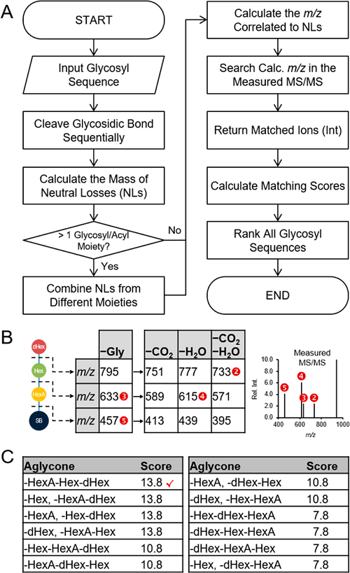

# PlantMAT
PlantMAT: A Metabolomics Tool for Predicting the Specialized Metabolic Potential of a System and for Large-Scale Metabolite Identifications

> This project is a VisualBasic.NET win32 app rewrite of the PlantMAT vba project.
> This project is not an official repository of plantMAT, you could download the official plantMAT from https://sourceforge.net/projects/plantmat/

## Features

+ upgrade from excel vba gui to WPF gui
+ implements R# language scripting feature

## Information

> Anal. Chem. 2016, 88, 23, 11373–11383 https://doi.org/10.1021/acs.analchem.6b00906 

Custom software entitled Plant Metabolite Annotation Toolbox (PlantMAT) has been developed to address the number one grand challenge in metabolomics, which is the large-scale and confident identification of metabolites. PlantMAT uses informed phytochemical knowledge for the prediction of plant natural products such as saponins and glycosylated flavonoids through combinatorial enumeration of aglycone, glycosyl, and acyl subunits. 

Many of the predicted structures have yet to be characterized and are absent from traditional chemical databases, but have a higher probability of being present in planta. PlantMAT allows users to operate an automated and streamlined workflow for metabolite annotation from a user-friendly interface within Microsoft Excel, a familiar, easily accessed program for chemists and biologists. The usefulness of PlantMAT is exemplified using ultrahigh-performance liquid chromatography–electrospray ionization quadrupole time-of-flight tandem mass spectrometry (UHPLC–ESI-QTOF-MS/MS) metabolite profiling data of saponins and glycosylated flavonoids from the model legume Medicago truncatula. 

The results demonstrate PlantMAT substantially increases the chemical/metabolic space of traditional chemical databases. Ten of the PlantMAT-predicted identifications were validated and confirmed through the isolation of the compounds using ultrahigh-performance liquid chromatography–mass spectrometry–solid-phase extraction (UHPLC–MS–SPE) followed by de novo structural elucidation using 1D/2D nuclear magnetic resonance (NMR). It is further demonstrated that PlantMAT enables the dereplication of previously identified metabolites and is also a powerful tool for the discovery of structurally novel metabolites.

> algorithmic procedure of combinatorial enumeration which involves the calculation of aglycone/glycosyl/acyl compositions and the generation of all possible glycosyl sequences

> algorithmic procedure for MS/MS spectral annotation

> algorithmic procedure for glycosyl sequencing